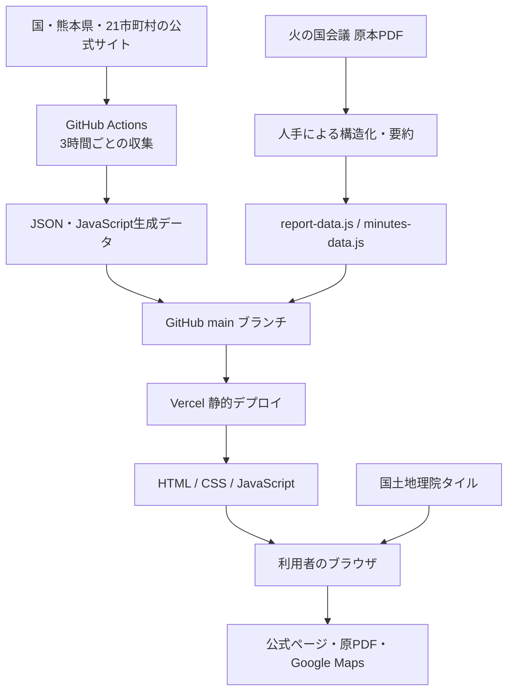
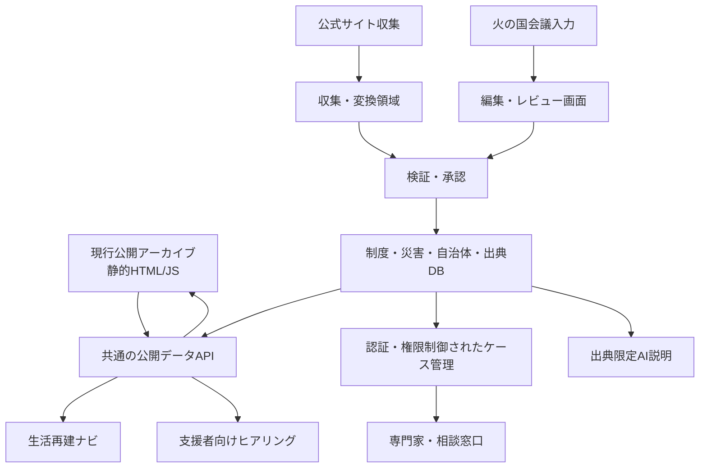

# 令和8年熊本地震 災害・支援情報サイト 現行システム分析報告書

- 対象リポジトリ: `koji0903/r8-kumamoto-saigai`
- 公開サイト: <https://r8-kumamoto-saigai.vercel.app/index.html>
- 調査日: 2026年8月9日
- 調査方針: 実際のコード、設定、保存データを根拠として分析。推測による構成決定は行わない。

## 現行システム総評

現行システムは、令和8年熊本地震に関する一次資料を保存し、災害状況・自治体発信・避難所・支援活動を閲覧できる静的アーカイブサイトである。

特に次の点は、今後も活かすべき強みである。

- 「火の国会議」と熊本県災害対策本部資料を役割分担している
- 原PDF、ページ番号、公式URLへ遡れる
- 推測や按分を避ける編集方針が明文化されている
- 市町村、日付、支援分野を横断して閲覧できる
- 3時間ごとの公式情報収集と整合性検査がある
- フレームワークやサーバーに依存せず、障害点が少ない
- JavaScriptエラー時や古い避難所情報に注意を表示する設計がある

一方、現在の構成は「少人数が確認しながら更新する情報アーカイブ」には適しているが、個人の被災状況を入力し、制度候補を判定し、支援経過を管理するプラットフォームにはまだ対応していない。

最大の課題はフロントエンド技術の古さではなく、次の4点である。

1. 制度・出典・自治体・災害・期限の統一データモデルがない
2. 火の国会議情報が複数ファイルへの手入力になっている
3. 自動収集の成功・失敗・鮮度を運用者が監視する仕組みが弱い
4. 個人情報を扱うためのバックエンド、認証、権限制御、監査基盤がない

全面リプレイスは不要である。現行の公開アーカイブを残したまま、構造化データ層、API、管理機能、個別支援機能を段階的に追加することが適切である。

調査時点の整合性検査では、会議11日分、市町村イベント45件、支援イベント46件、構造化議事録11回分、開設中避難所120件、市町村公式発信383件について検査に成功した。

## 技術構成

### 技術スタック

| 項目 | 現状 |
|---|---|
| 使用言語 | HTML、CSS、JavaScript、Node.js、Python |
| フロントエンド | Vanilla JavaScriptによるDOM描画 |
| TypeScript | 使用なし |
| Webフレームワーク | 使用なし |
| CSSフレームワーク | 使用なし |
| UIライブラリ | 使用なし |
| 地図 | Leaflet 1.9.4をリポジトリ内に同梱 |
| 地図タイル | 国土地理院タイルをブラウザから取得 |
| グラフ | 独自SVG・DOM描画。Chart.js等は不使用 |
| ビルドシステム | なし |
| パッケージマネージャ | なし |
| `package.json` | 存在しない |
| Node.js | 公式サイト収集、データ生成、検証に使用 |
| Python | 熊本県PDFの抽出に使用。PyMuPDFが必要 |
| データベース | 使用なし |
| Firebase/Supabase/PostgreSQL | 使用なし |
| API Routes | なし |
| Serverless/Edge Functions | なし |
| LocalStorage/IndexedDB | 使用なし |
| AI機能 | 使用なし |
| Markdown管理 | README等の文書のみ。サイト本文のCMS用途では不使用 |
| ブラウザ側API取得 | 原則なし。生成済みJavaScriptを読み込む |
| 外部CDN | なし |
| 実行時外部通信 | 地図タイル取得、公式サイトやGoogle Mapsへのリンク |

共通描画は `app.js`、基本CSSは `styles.css`、補助デザインは `design-system.css`、`global-modern.css`、`mobile-polish.css` などに分かれている。

### Vercel・デプロイ構成

リポジトリ内には以下が存在しない。

- `vercel.json`
- ビルドコマンド
- Output Directory設定
- Vercel Functions
- Edge Functions
- API Routes
- Vercel用環境変数参照
- production/previewを切り替えるコード

したがって、現在はリポジトリ直下をそのまま公開する、Vercelのゼロコンフィグ静的配信と判断できる。SSRではない。

公式データ更新は `.github/workflows/refresh-official-data.yml` が3時間ごとに実行し、検査成功後に `main` へ直接コミット・pushする。URLは `index.html`、`guide.html` のような物理HTMLファイル単位であり、リライトや拡張子を除去する設定はない。

READMEには公開先が「GitHub Pages」と記載されており、現在のVercel運用と一致していない。

### 現行アーキテクチャ



### 主要ディレクトリ

```text
リポジトリ直下
├── *.html                         各公開ページ
├── app.js                         共通描画・ナビ・トップ・タイムライン等
├── hq.js                          県災害対策本部データ表示
├── minutes.js                     火の国会議ビューア
├── municipality-updates.js        市町村公式発信
├── shelters.js                    避難所地図
├── volunteer-centers.js           災害VC情報
├── uto-waste.js                   宇土市災害ごみ案内
├── *.css                          共通・ページ別デザイン
├── data/
│   ├── report-data.js             手編集のサマリー・時系列
│   ├── minutes-data.js            手編集の構造化議事録
│   ├── shelter-supplements.json   手編集の避難所補足
│   └── generated/                 自動生成された表示用データ
├── sources/
│   ├── hinokuni-meetings/         火の国会議原PDF
│   ├── official/                  公式サイト由来の原データ
│   ├── uto/                       宇土市災害ごみ資料
│   └── design/                    OGP等の素材
├── tools/                         取得・抽出・検証スクリプト
├── vendor/leaflet/                Leaflet 1.9.4
├── .github/workflows/             定期更新
└── README.md                      運用・更新手順
```

APIディレクトリ、DBマイグレーション、認証設定、CMS設定は存在しない。

## ページ構成

| URL／ファイル | ページと目的 | 主な利用者 | 主なデータ・依存 |
|---|---|---|---|
| `index.html` | サマリー、被災指標、公式トピックス、推移 | 全利用者 | report、HQ、official topics、app.js |
| `affected.html` | 被災者向け入口 | 被災者・家族 | report、app.js |
| `supporters.html` | 支援者向け入口 | 支援団体・個人 | report、app.js |
| `municipalities.html` | 自治体別被害・支援状況 | 全利用者 | report、HQ、app.js、hq.js |
| `municipality-updates.html` | 市町村公式発信の時系列・分類 | 全利用者 | municipality updates |
| `support.html` | 支援分野別の活動・ニーズ | 支援者 | report、app.js |
| `shelters.html` | 開設中避難所の地図・一覧・補足 | 被災者・支援者 | shelters、report、Leaflet |
| `guide.html` | 法制度・生活再建のやさしい解説 | 被災者・支援者 | HTML直書き、report |
| `terms.html` | 災害用語の検索・解説 | 全利用者 | terms.js |
| `timeline.html` | 日ごとの状況・変化・活動記録 | 全利用者・研究者 | report、app.js |
| `meetings.html` | 火の国会議の構造化閲覧・検索 | 支援者・研究者 | minutes、app.js |
| `official.html` | 国・県・市町村の一次情報入口 | 全利用者 | HQ、report |
| `uto-waste.html` | 宇土市災害ごみの品目・持込先案内 | 宇土市の被災者 | 専用JS、Leaflet、公式資料 |
| `volunteer-centers.html` | 自治体別災害VCの状況・公式発信 | 支援者・ボランティア | minutes、municipality updates |

### 実装済み機能

- 被害・避難・断水等の最新値表示
- 日別推移グラフ、前日との差分表示
- 日ごとの要約、行動、現場報告
- 自治体別被害情報
- 市町村公式記事の検索、分類、時系列表示
- 火の国会議の回別閲覧、テーマ別検索、原PDF参照
- 支援分野別絞り込み
- 開設中避難所の検索、地図、詳細パネル
- 災害ボランティアセンターの自治体別表示
- 災害用語検索
- 制度解説のアコーディオン
- 公式情報・一次資料への外部リンク
- 宇土市災害ごみの品目判定、持込先、ルート検索
- モバイルメニュー
- JavaScript異常時のエラー案内
- 避難所データが6時間以上古い場合の警告
- SNS用OGP、Twitter Card、favicon

本格的なログイン、ユーザー入力保存、個別判定、申請管理、通知、ケース管理は実装されていない。

## データ構成

### `REPORT_DATA`

保存先: `data/report-data.js`

手編集される中核データであり、主に次を保持する。

- `disaster`
- `officialSources`
- `municipalities`: 21市町村
- `municipalEvents`: 45件
- `supportCategories`: 8分類
- `supportEvents`: 46件
- `metrics`: 推移指標
- `days`: 11日分の日次情報

`municipalEvents` と `supportEvents` には日付、会議回、PDFページ、分類、自治体、題名、説明、PDFが入る。`days` には日付、会議回、発災日数、参加者、PDF、自治体、統計、トピック、要約、対応、注記が入る。独立した永続IDはなく、日付・会議回・配列位置などが実質的な識別子である。

### `MINUTES_DATA`

保存先: `data/minutes-data.js`

火の国会議11回分を議事構造に沿って手作業で記録している。会議回、日付、発災日数、資料ページ数、PDF、会場、参加者、参加団体、議題セクション、災害VC表、テーマタグを保持する。

原PDFとページ番号へ追跡できる点は優れている。

### 県公式被害データ

保存先: `data/generated/hq-damage-data.js`

取得メタデータ、日時、災害対策本部会議回、市町村別被害、合計、罹災証明情報、注記等を保持する。16時点分が保存され、県PDFから自動抽出されている。

### 市町村公式発信

保存先:

- `sources/official/municipalities/municipality-updates.json`
- `data/generated/municipality-updates.js`

21市町村、383記事を収録する。記事には自治体、タイトル、URL、発表日、発表時刻、自動分類がある。自治体単位では、公式URL、確認日時、取得状態、巡回元、巡回ページ数、エラーも保持する。

### 公式トピックス

保存先:

- `sources/official/topics/latest-topics.json`
- `data/generated/official-topics.js`

国6件、熊本県3件、市町村20件を保持する。発表主体、種別、日付、時刻、URLがある。

### 避難所

保存先:

- `data/generated/shelters-data.js`
- `data/shelter-supplements.json`
- `sources/official/` 配下の原JSON

開設中120件を保持し、県施設ID、施設名、住所、自治体、緯度・経度、開設日時、定員、混雑状態、指定区分、火の国会議による補足を持つ。施設IDが主キー相当である。

### HTML・JavaScript直書きデータ

次の情報は統一データとして管理されていない。

- `guide.html` の法制度と生活再建説明
- `terms.js` の用語集
- `uto-waste.js` の施設、住所、品目、時間、停止日
- 一部の公式リンク、注意文、更新基準日
- ページ固有の説明文

CSVは使われていない。Markdownも公開コンテンツDBとしては使われていない。

### 二重管理

- 同じ会議内容を `report-data.js` と `minutes-data.js` に手入力
- 県公式情報を原JSONとブラウザ用JSで保持
- 市町村記事を原JSONとブラウザ用JSで保持
- 法制度の説明が `guide.html` と `terms.js` に分散
- 自治体名・公式URLが複数ファイルに存在
- 宇土市災害ごみ情報が専用JSと保存資料に分かれる

原JSONと生成JSの併存には静的配信上の合理性があるが、生成元と生成物の関係を厳格にしないと差異が発生する。

## 情報更新フロー

### 火の国会議

1. PDFを `sources/hinokuni-meetings/` に保存
2. `data/report-data.js` に日次統計、要約、自治体イベント、支援イベントを追記
3. `data/minutes-data.js` に議事録本文を構造化して追記
4. 必要に応じて避難所補足等も編集
5. `node tools/check-data.mjs` を実行
6. GitHubへ反映
7. Vercelで公開

この部分が最も人手と判断を要し、二重入力と更新漏れの中心である。

### 熊本県災害対策本部

1. `fetch-hq.mjs` が資料一覧とPDFを取得
2. `build-hq-damage.py` がPDFを抽出
3. 原JSONと表示用JavaScriptを生成
4. `check-data.mjs` で整合性を検査
5. GitHub Actionsが `main` に自動反映

### 市町村情報

`fetch-municipality-updates.mjs` が21市町村の公式トップ、地震特設ページ、ページ送り、記事詳細を巡回する。ただし、取得できなかったことと情報が存在しないことは同義ではない。サイト構造変更、JavaScript描画、WAF、PDF内情報などによって未検出になる可能性がある。

### 制度情報

制度情報には自動更新フローがなく、`guide.html` 等を直接修正する。制度の適用状況、対象自治体、申請期限、必要書類が変化した場合、更新漏れを機械的に検出できない。

### 自動更新上の課題

- 3時間ごとに `main` へ直接pushする
- GitHub Actions失敗時の外部通知がない
- 最終成功時刻を運用画面で一覧監視できない
- 自治体サイトのHTML変更による取得件数急減を異常判定しない
- 自動分類の誤分類をレビューする管理画面がない
- 火の国会議の構造化は自動化されていない
- Vercelデプロイ成功までを検証していない

## 強み

### 情報の信頼性

READMEでは「出典を必ず添える」「推測・按分をしない」「定義変更を隠さない」と明記されている。県公式集計と火の国会議の値を突合する検証もあり、単なる表示確認より強い品質管理となっている。

### 静的サイトとしての堅牢性

- DB障害がない
- サーバー障害点が少ない
- 認証やセッションの問題がない
- Vercel/CDNから高速配信しやすい
- 原PDFと生成データをGit履歴で保存できる
- 後日の研究・検証に向く

### 利用者別の入口

被災者、支援者、自治体別、支援分野別、日別、会議別に入口が分かれており、一つの分類だけに依存していない。

### アクセシビリティ上の良い点

- `lang="ja"`、viewport設定
- 本文へのスキップリンク
- `main`、`header`、`nav` 等のランドマーク
- 原則1ページ1つの `h1`
- 検索入力へのラベル
- `aria-current`、`aria-expanded`、`aria-pressed`
- `aria-live`を使った検索結果更新
- ネイティブのボタン、リンク、`details/summary`
- `:focus-visible` の明確なアウトライン
- モバイルレイアウト
- JavaScript無効時の注意表示
- SVGグラフとは別に数値表を参照できる構成

## 技術的課題

### 出典管理が統一されていない

| 情報 | 出典管理 |
|---|---|
| 火の国会議 | PDF、会議回、ページまで保持 |
| 県被害情報 | 原PDF、会議回、発表日時、取得情報を保持 |
| 市町村発信 | 公式URL、発表日、取得日時を保持 |
| 制度ガイド | HTML内の個別リンク。統一構造なし |
| 用語集 | 説明中心。発表主体や更新履歴が弱い |
| 宇土市ごみ | 公式ページとチラシはあるが専用実装 |
| 独自要約 | 原資料との関係が項目ごとに一定ではない |

将来は最低でも、出典ID、発表主体、原文URL、原資料種別、発表日時、取得日時、内容確認日時、適用開始・終了日時、対象地域、根拠箇所、要約種別、確認者、更新履歴、失効・訂正状態を共通化する必要がある。

### 制度・生活再建情報

現状は主として `guide.html` への直書きである。

| 制度等 | 現在の実装 |
|---|---|
| 災害救助法 | 適用状況と解説を静的表示 |
| 激甚災害 | 指定情報と解説を静的表示 |
| 被災者生活再建支援法 | 解説あり。適用状況は確認待ち表現 |
| 罹災証明 | 解説あり。県資料の日程情報とは別管理 |
| 住宅の応急修理 | 一般説明と会議由来情報 |
| 応急仮設住宅 | 一般説明と会議由来情報 |
| 災害援護資金 | 見舞金等とまとめて静的説明 |
| 災害ケースマネジメント | 用語集レベル |

条件判定、世帯・被害状況との照合、自治体別制度レコード、災害IDとの正式な関連、申請期限モデル、必要書類モデル、制度変更履歴、対象条件の機械可読化、相談・申請状況の保存は存在しない。

### アクセシビリティ上の課題

- 主要情報の多くがJavaScript描画で、無効時は内容を閲覧できない
- 小さい補足文字や淡いサブテキストが一部あり、高齢者には厳しい可能性がある
- 自動WCAG検査やスクリーンリーダー試験がない
- 印刷専用設計がサイト全体で統一されていない
- 地図操作説明が限定的
- モバイルメニューを開いた後のフォーカストラップやEscape処理がない
- 動的CSS読込により、一瞬レイアウト未適用になる可能性がある
- サイト名の明白な誤ARIAラベルは確認されなかったが、動的なブランド表記差替えは保守リスクがある

### SEO・共有

全ページに概ねtitle、description、OGP、Twitter Card、faviconがある。一方、以下が不足している。

- `canonical`
- `robots.txt`
- `sitemap.xml`
- 構造化データ
- 多くのページで絶対URLの `og:url`
- 一部OGP画像の絶対URL
- 記事・更新日時の構造化メタデータ
- JavaScriptを実行しないクローラ向け本文

SNS共有では `uto-waste.html` の専用OGPが最も整っている。他ページは相対パスやページ共通表現が多く、クローラによっては画像取得が不安定になる可能性がある。

### パフォーマンス

- `app.js` が読込後に複数CSSを追加するため、再描画やFOUCが発生し得る
- 大きな生成データをJavaScriptグローバルとしてページ単位で読み込む
- `minutes-data.js` 約229KB
- 県被害データ約199KB
- 市町村記事データ約121KB
- Leaflet JavaScript約147KB
- 避難所120件のマーカーを一度に生成
- CSSが複数層に分かれ、上書き関係が複雑
- ハッシュ付きアセット、明示的キャッシュヘッダーがない
- 原PDF、過去の避難所JSON、HEIC、JPEG等も静的デプロイ対象になり得る
- OGP背景画像の重複がある
- 画像最適化パイプラインがない

一方、外部CDNや巨大なフレームワークを使っていないため、通常表示の基礎性能は悪くない。

### セキュリティ

現時点では静的サイトで、ログイン・フォーム送信・DB・サーバーAPIがないため、攻撃面は比較的小さい。

良い点:

- APIキーや秘密情報の参照は確認されない
- 外部リンクには概ね `rel="noopener"`
- 市町村記事等は表示前にエスケープしている
- LocalStorageやCookieに機密情報を保存していない
- npm依存がなく、依存パッケージ攻撃面が小さい

注意点:

- `innerHTML`、`insertAdjacentHTML` が多数ある
- 外部サイトから取得した文字列に将来エスケープ漏れが生じるとXSS要因になる
- CSP、Permissions-Policy等のセキュリティヘッダー設定がない
- Leafletの更新は手動管理
- GitHub Actionsに `contents: write` があり、`main` に直接pushする
- 外部サイトやPDFが侵害された場合のレビュー境界が弱い
- 収集結果の異常件数や内容急変を止める仕組みがない

CORSは現状の静的構成では主要課題ではない。

## 今すぐ直すべき問題

### Critical

現時点で、公開を直ちに停止すべきコード上の障害や整合性エラーは確認されなかった。

ただし、将来個人情報を保存し始める場合、現在の静的構成へそのまま追加することはCriticalなリスクとなる。ケース管理を開始する前に、認証・権限・暗号化・監査を設計する必要がある。

### High

1. **制度情報を統一データ化する**  
   HTML直書きのままでは、対象自治体、適用条件、期限、必要書類、出典の更新漏れを防げない。

2. **自動更新の監視を設ける**  
   Actions失敗、取得件数急減、データ鮮度超過、Vercel反映失敗を通知する必要がある。

3. **火の国会議の二重入力を解消する**  
   `report-data.js` と `minutes-data.js` を別々に編集する方式は、日付・回数・数値・要約の食い違いを生みやすい。

4. **`main`への自動直接pushを見直す**  
   異常値を含む自動データが即時公開される危険があり、ステージング、自動生成ブランチ、差分レビュー、異常時停止が望まれる。

5. **公開基準時刻を統一表示する**  
   発表日時、取得日時、サイト反映日時を明確に区別する必要がある。

6. **Vercel運用情報を文書化する**  
   READMEのGitHub Pages表記を実際の運用と一致させる必要がある。

## 将来拡張時に問題になる箇所

| 重要度 | 技術的負債 |
|---|---|
| Critical | 個人情報・相談記録を扱う認証、権限、監査、同意、削除設計がない |
| Critical | 制度候補判定に利用できる厳密な条件データモデルがない |
| High | 制度、自治体、災害、期限、出典を結ぶ共通IDがない |
| High | 手編集データの二重入力 |
| High | 自動収集結果を人が承認するワークフローがない |
| High | 情報の有効期間、訂正、失効を管理できない |
| High | 取得処理と公開処理が同一Actions内で直結している |
| High | ブラウザE2E・アクセシビリティ検査がない |
| Medium | グローバル変数 `window.*` によるデータ受け渡し |
| Medium | 共通UIとページ固有処理が `app.js` に集中 |
| Medium | CSSの上書き層が多く、変更影響を予測しにくい |
| Medium | canonical、sitemap、構造化データがない |
| Medium | 大きなデータファイルの全件読込 |
| Medium | 生データと表示用JavaScriptの重複 |
| Medium | 公式サイトの構造変更に弱いスクレイピング |
| Low | `.html`付きURL |
| Low | vendored Leafletの手動更新 |
| Low | OGP素材や過去原データの容量整理不足 |

## 生活再建支援プラットフォームへの拡張可能性

| 将来機能 | 評価 | 理由 |
|---|---|---|
| 支援制度DB | 中規模改修 | データ設計と管理方法が必要 |
| 自治体別制度DB | 中規模改修 | 自治体・制度・適用期間の関連が必要 |
| 民間支援DB | 中規模改修 | 提供主体、地域、定員、期限、確認状態が必要 |
| 被災者向け質問フォーム | 小規模改修 | 保存しない案内フォームなら可能 |
| 回答保存付き質問フォーム | 大規模改修 | DB、同意、セキュリティが必要 |
| 支援制度候補判定 | 大規模改修 | 条件の形式知化と法的・運用的検証が必要 |
| 生活再建ロードマップ | 中規模改修 | 匿名・一般モデルなら段階導入可能 |
| 災害ケースマネジメント | 大規模改修 | ケース、担当者、同意、履歴、権限が必要 |
| 支援者向けヒアリング | 中規模改修 | 端末内だけなら小規模、共有保存なら大規模 |
| AIによる制度説明 | 中～大規模改修 | RAG、引用、更新管理、誤回答抑制が必要 |
| 管理画面 | 中規模改修 | DB/API/CMS導入が前提 |
| CMS | 中規模改修 | 制度・告知の編集承認に有効 |
| API | 中規模改修 | 現行静的ページと並行追加可能 |
| PostgreSQL | 中規模改修 | 構造化制度・出典・履歴に適する |
| Firebase/Supabase | 中規模改修 | 認証・DB導入は可能だが権限設計が必要 |
| 認証 | 大規模改修 | 支援者、管理者、専門家等の役割設計が必要 |
| 支援ケース管理 | 大規模改修 | 要配慮個人情報を扱うため独立設計が必要 |
| 災害アーカイブ拡充 | 現状～小規模改修 | 現行構成が得意とする領域 |
| 自治体・現場情報拡充 | 小規模改修 | 現行データと取得処理を拡張可能 |

### 推奨する将来アーキテクチャ



公開情報と個別ケース情報は、同じDBに無造作に混在させず、権限・保存期間・監査要件を分けるべきである。

## 推奨する次の開発ステップ

### 第1段階：現行アーカイブの運用品質を固める

- Vercel/GitHub Actionsの運用構成を正式に文書化
- 発表日時、取得日時、確認日時、公開日時の定義を統一
- 更新失敗・鮮度超過・件数急減の通知
- 自動更新から本番公開までの承認境界を設定
- Lighthouse、axe、リンク検査、主要ページのE2Eを追加
- canonical、sitemap、robots、構造化データを整備
- 原資料保存と公開アセットを分離

### 第2段階：共通データモデルを作る

最初に次のエンティティを設計する。

- Disaster
- Municipality
- Organization
- Source
- SourceRevision
- OfficialAnnouncement
- Meeting
- MeetingItem
- SupportProgram
- EligibilityRule
- ApplicationWindow
- RequiredDocument
- ContactPoint
- Shelter
- VolunteerCenter
- SupportActivity

制度データには、説明文だけでなく、対象地域、対象者、条件、必要書類、期限、併用可否、原典、確認日、失効状態を持たせる。

### 第3段階：火の国会議入力を一本化する

一つの構造化会議データから、日々の記録、自治体別情報、支援分野別情報、災害VC情報、トップページ要約、議事録ビューアを自動生成できる形にする。

人手による要約は残しても、会議回、日付、PDF、ページ、自治体、カテゴリの二重入力はなくすべきである。

### 第4段階：制度・生活再建ガイドをデータ駆動化する

いきなり個人情報を保存せず、まずは匿名で使える機能から始める。

1. 自治体を選択
2. 被害区分を選択
3. 住まい・収入・家族等を任意選択
4. 候補制度を表示
5. 判定理由と不足情報を表示
6. 必ず公式窓口と原典を案内
7. 結果を印刷・端末内保存

この段階では「受給できます」と断定せず、「候補」「確認が必要」と表現する。

### 第5段階：ケース管理を独立して設計する

個別支援記録を保存する段階では、本人同意、支援者の所属確認、閲覧・編集権限、要配慮情報の範囲、保存期間、開示・訂正・削除、操作監査ログ、端末紛失対策、データ輸出、インシデント対応を先に決める必要がある。

AI機能はその後に、承認済み制度DBと原典だけを参照させ、回答ごとに出典・確認日・不確実性を表示する構成が安全である。

## 次の実装へ進む前に確認・決定すべき事項

- 公開アーカイブと個別支援システムを同一サービスにするか、分離するか
- 運営主体と情報の最終確認責任者
- 制度情報の更新・承認フロー
- 自動取得結果を即時公開するか、人が承認するか
- 「公式情報」「現場報告」「編集部要約」の表示ルール
- 共通の災害ID、自治体ID、制度ID、出典ID
- 情報の発表日時・取得日時・確認日時・失効日時の定義
- 制度候補判定で扱う条件と、断定を避ける表示方針
- 自治体ごとの差異をどこまでデータ化するか
- 個人情報を保存しない匿名ナビから開始するか
- ケース管理で取り扱う個人情報の範囲
- 被災者本人、同行支援者、専門家、管理者の権限
- 同意取得、保存期間、削除、監査ログの方針
- CMSまたは管理画面の編集者・承認者
- PostgreSQL、Supabase等の選定基準
- Vercel production/previewの運用ルール
- GitHub Actionsから本番反映までのレビュー方式
- 更新失敗、情報陳腐化、取得件数異常の通知先
- アクセシビリティの目標水準。推奨はWCAG 2.2 AA
- AIが参照できる資料と、回答できない事項の境界
- 長期アーカイブとして原資料を保存する期間と容量方針

現行サイトは、公開アーカイブ層として十分に活かせる。次に着手すべき中心課題はフレームワーク移行ではなく、「制度・出典・自治体・災害を結ぶデータモデル」と「情報のレビュー・更新責任を支える運用基盤」である。
