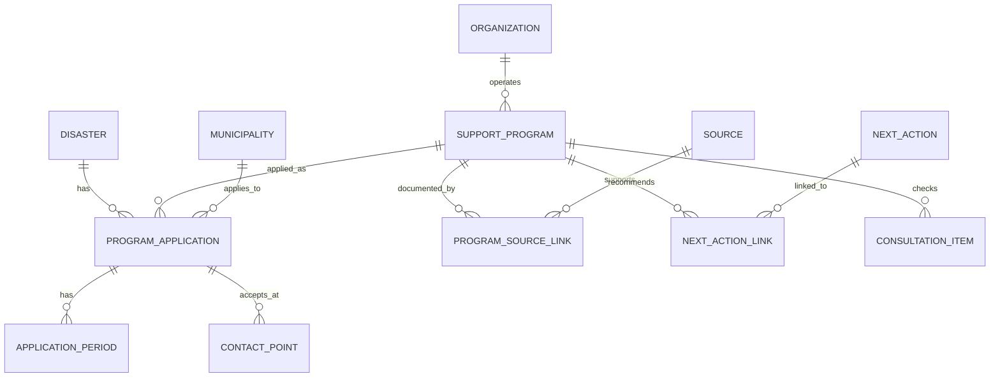

# 令和8年熊本地震 生活再建支援機能 情報設計書

- 対象リポジトリ: `koji0903/r8-kumamoto-saigai`
- 公開サイト: <https://r8-kumamoto-saigai.vercel.app/index.html>
- 作成日: 2026年8月9日
- 位置づけ: 設計資料。制度条件や今回の災害への適用を確定するものではない。

## 現状から維持すべきもの

現行サイトは、生活再建支援機能を載せるための「信頼できる公開情報基盤」として活用できる。全面リプレイスは不要である。

### 維持・改修区分

| 対象 | 評価 | 方針 |
|---|---|---|
| トップページ | B：小規模改修 | 現在の災害サマリーを維持し、将来「困りごとから探す」入口を追加 |
| 被災者向けページ | B | 現在の入口を、生活再建ナビへの簡潔な導線に発展 |
| 支援者向けページ | B | 災害VC・支援分野を維持し、相談時確認機能へ接続 |
| 自治体別ページ | B | 被害・公式発信に、自治体別制度と窓口を接続 |
| 制度・生活再建ガイド | C：再設計 | HTML直書きを、統一された制度・適用・出典データからの表示へ移行 |
| 火の国会議 | A：そのまま維持 | 原PDF、会議回、ページ番号への追跡性を維持 |
| 火の国会議の手入力方式 | C | `report-data.js` と `minutes-data.js` の二重入力を将来一本化 |
| 日々の記録 | A | 現場の変化を伝えるアーカイブとして維持 |
| 地図 | A | Leafletと国土地理院タイルを維持 |
| 避難所 | B | 現行表示を維持し、鮮度表示と自治体窓口との関係を強化 |
| 災害ボランティアセンター | B | 自治体・公式発信・支援活動との関連を強化 |
| GitHub Actions | B | 収集基盤は維持し、失敗通知・件数異常検知・公開前確認を追加 |
| 自動収集 | B | 収集を維持し、人による確認状態を管理できるようにする |
| データ検証 | A＋拡張 | 現行検査を維持し、制度期限・出典・適用範囲の検査を追加 |
| Vercel静的配信 | A | 当面の公開方式として適切 |
| HTML/CSS/Vanilla JS | A | 今回の情報設計段階で変更する必要はない |

### 必ず維持する信頼性基盤

- 公的な一次情報を優先する
- 火の国会議の原PDFを保存する
- 会議回とPDFページを追跡できる
- 公式URLへ直接移動できる
- 推測、按分、無根拠な補完をしない
- 不明な数値をゼロとして扱わない
- 発表時点と取得時点を明示する
- 自動検査に合格しない情報を公開しない
- 本サイトが行政機関の一次発表ではないことを明示する

## 生活再建支援機能の基本思想

この機能は「制度を検索するデータベース」ではなく、被災者と支援者が次の一歩を判断するための案内基盤とする。

### 設計原則

1. 制度名ではなく「困っていること」を入口にする
2. 最初に表示する情報は一画面で理解できる量にする
3. 最初に「次に何をするか」を示す
4. 条件や法的説明は必要な人だけ開ける
5. 公的制度は一次情報だけを正式根拠とする
6. 一般制度の存在と今回の災害への適用を分離する
7. 国の制度、県の適用、市町村の受付情報を区別する
8. 不明な情報は推測せず「確認中」と表示する
9. 利用可能性は示しても、対象者だと断定しない
10. 支援者には確認項目を提示するが、被災者に長い質問票を強制しない
11. スマートフォン、高齢者、精神的余裕のない人を基準にする
12. AIに制度、条件、期限、対象者を生成させない
13. 現段階では個人情報を取得・保存しない

### 情報の表示順

1. 何を助ける制度か
2. 今回の災害で利用できる可能性
3. 今すぐ注意すること
4. 次にすること
5. 主な対象条件
6. 必要書類
7. 申請先・相談先
8. 期限
9. 公式情報
10. 支援者向け詳細

正式制度名は必要だが、最初の見出しにはしない。

## 想定利用者と利用場面

### 被災者・家族

主な目的:

- 自分の困りごとに関係する支援を知る
- 相談時に聞いた制度を再確認する
- 必要書類、期限、相談先を確認する
- 何を最初に行うべきかを知る

必要な表示:

- 短く平易な説明
- 大きな文字
- 少ない選択肢
- 電話・地図・公式ページへの明確なボタン
- 印刷可能な持参用メモ
- 「契約前に確認」などの重要警告

### 地域の支援者

対象は、ボランティア、民生委員、地域役員、社協関係者、NPO、自治体職員、被災者の家族などである。

主な目的:

- 相談時に確認する項目を知る
- 関係しそうな制度を漏れなく探す
- 断定せず、適切な窓口へつなぐ
- 必要書類や申請前の注意点を伝える

必要な表示:

- 被災者向け説明
- 追加の確認項目
- 判定できない条件
- 制度の併用・順序に関する注意
- 公式根拠
- 自治体窓口
- 情報の確認状態と最終確認日時

### 利用モード

個別データを保存せず、表示情報量のみ切り替える。

- 「自分・家族で確認する」
- 「相談を受けながら確認する」

制度データ自体は共通にし、支援者向けの追加情報だけを段階表示する。

## 情報分類

カテゴリは増やしすぎず、最上位を8分類とする。

| ID | 利用者向け名称 | 含まれる内容 |
|---|---|---|
| `home` | 住まいをどうする | 修理、解体、仮住まい、家賃、住宅再建 |
| `money` | お金・支払い | 支援金、見舞金、生活費、税、保険料、ローン、借金 |
| `documents` | 証明・申請 | 罹災証明、被災証明、本人確認、申請書類 |
| `health_care` | 健康・介護 | 医療、心のケア、高齢者、介護、障がい福祉 |
| `family_education` | 子ども・家族 | 学校、保育、学用品、ひとり親、家族支援 |
| `work_business` | 仕事・事業 | 雇用、休業、事業所、店舗、中小企業 |
| `agriculture_fishery` | 農業・漁業 | 農地、農機、家畜、水産設備、事業継続 |
| `daily_life` | 暮らし・移動 | 車、交通、ごみ、ライフライン、物資、相談窓口 |

必要に応じてサブカテゴリを使用する。高齢者・障がい・ひとり親等は、最上位カテゴリだけでなく横断的な対象属性としても管理する。

## 支援制度データモデル

制度を一つの巨大なオブジェクトに詰め込まず、次の単位に分離する。



### `supportProgram`：制度マスタ

災害ごとの適用状況を含めず、制度そのものの一般的な定義を保持する。

| 項目 | 内容 |
|---|---|
| `id` | 永続的な内部ID |
| `officialName` | 正式制度名 |
| `displayName` | 一般向け名称 |
| `shortDescription` | 一文の説明 |
| `providerType` | `public` / `private` |
| `governmentLevel` | `national` / `prefectural` / `municipal` / `none` |
| `operatorOrganizationId` | 制度実施主体 |
| `categories` | 困りごとカテゴリ。複数可 |
| `subCategories` | 詳細分類 |
| `benefitType` | 給付、貸付、減免、現物、住宅、相談等 |
| `defaultSupportDescription` | 一般的な支援内容 |
| `generalConditions` | 一般的な条件。確認できない場合は空 |
| `audienceSummary` | 被災者向け説明 |
| `supporterSummary` | 支援者向け説明 |
| `importantWarnings` | 契約前確認等の重要注意 |
| `lifecycleStatus` | 制度マスタ自体の状態 |
| `createdAt` | 登録日時 |
| `updatedAt` | 更新日時 |

金額、期限、対象地域、今回の災害での対象条件は、原則として制度マスタに固定しない。それらは災害適用情報で管理する。

### `conditionDefinition`：条件定義

制度の判定候補に用いる条件を機械可読にする。

```json
{
  "field": "housingDamage",
  "operator": "in",
  "values": ["pending_confirmation"],
  "certainty": "unknown",
  "sourceLinkIds": []
}
```

主な条件軸:

- `housingDamage`
- `householdType`
- `housingType`
- `residencyStatus`
- `incomeCondition`
- `ageCondition`
- `disabilityCondition`
- `careCondition`
- `businessType`
- `agricultureCondition`
- `contractStatus`
- `otherProgramUsage`
- `otherConditions`

確認できていない条件は、推測した値を入れず `unknown` とする。

### `requiredDocument`

```json
{
  "id": "doc_risai_certificate",
  "name": "罹災証明書",
  "requiredLevel": "check_with_office",
  "notes": "今回の災害における必要性は受付自治体へ確認してください。",
  "sourceLinkIds": []
}
```

`requiredLevel` は `required`、`conditional`、`recommended`、`check_with_office`、`unknown` を想定する。

### `contactPoint`

窓口名、組織ID、自治体ID、住所、電話番号、受付時間、休業日、公式URL、対応方法、対応言語、バリアフリー情報、有効期間、確認日時を保持する。電話番号や受付時間は変わり得るため、制度本体から分離する。

## 出典データモデル

制度本体と出典は分離する。1制度に国・県・市町村の複数資料が存在し、それぞれが別の事実を裏付けるためである。

### `source`

| 項目 | 内容 |
|---|---|
| `id` | 出典ID |
| `organizationId` | 発表主体 |
| `sourceType` | Web、PDF、告示、要綱、申請案内等 |
| `title` | 公式資料名 |
| `url` | 原文URL |
| `publishedAt` | 発表日時 |
| `revisedAt` | 原資料の更新日時 |
| `retrievedAt` | システム取得日時 |
| `checkedAt` | 人が内容を確認した日時 |
| `contentHash` | 内容変更検知用 |
| `archivedPath` | 保存した原資料へのパス |
| `officiality` | `primary_official` 等 |
| `status` | 有効、差替え、撤回、リンク切れ |
| `notes` | 注記 |

### `sourceLink`

| 項目 | 内容 |
|---|---|
| `id` | 関連ID |
| `sourceId` | 出典 |
| `entityType` | program、application、period、contact等 |
| `entityId` | 対象レコード |
| `claimType` | 制度概要、適用、期限、窓口、条件等 |
| `page` | PDFページ |
| `section` | Web見出し・表番号 |
| `excerpt` | 必要最小限の根拠抜粋 |
| `verifiedBy` | 確認担当 |
| `verifiedAt` | 確認日時 |

同じ制度について、国の制度説明、熊本県での適用、市町村の受付開始・期限・窓口を別の出典として保持する。市の受付情報が確認できない場合、国の一般説明だけを根拠に「市で受付中」と表示してはならない。

## 災害適用データモデル

制度の存在と今回の災害への適用を明確に分離する。

### `disaster`

```json
{
  "id": "disaster_2026_kumamoto_earthquake",
  "officialName": "令和8年熊本地震",
  "occurredAt": "2026-07-28T16:27:00+09:00",
  "status": "ongoing",
  "areaIds": [],
  "sourceLinkIds": []
}
```

### `programApplication`

制度を特定災害・地域へ適用する中核レコードとする。

| 項目 | 内容 |
|---|---|
| `id` | 適用ID |
| `programId` | 制度マスタ |
| `disasterId` | 対象災害 |
| `municipalityIds` | 対象自治体 |
| `areaScope` | 国、県、一部地域等 |
| `applicationStatus` | 適用中、確認中、発表待ち、終了等 |
| `effectiveFrom` | 適用開始 |
| `effectiveUntil` | 適用終了 |
| `eligibleDamage` | 対象被害 |
| `eligibilityConditions` | 今回の条件 |
| `specialRules` | 特例 |
| `supportDescription` | 今回の支援内容 |
| `amountDescription` | 金額・上限等。構造化と原文表示を併用 |
| `requiredDocuments` | 今回必要な書類 |
| `applicationMethod` | 申請方法 |
| `applicationPeriodIds` | 受付期間 |
| `contactPointIds` | 申請・相談窓口 |
| `sourceLinkIds` | 適用根拠 |
| `verificationStatus` | 検証状態 |
| `lastCheckedAt` | 最終確認 |
| `notes` | 留保・自治体確認事項 |

### 受付期間

```json
{
  "id": "period_example",
  "applicationId": "application_example",
  "startsAt": null,
  "deadlineAt": null,
  "deadlineType": "pending",
  "isExtended": false,
  "previousDeadlineAt": null,
  "status": "pending_announcement",
  "sourceLinkIds": []
}
```

期限変更時に上書きするだけでは、以前の情報を見た利用者への説明ができない。変更履歴を保持する。

## 自治体独自制度の扱い

自治体独自制度も `supportProgram` と `programApplication` の同じ仕組みで管理する。

```json
{
  "providerType": "public",
  "governmentLevel": "municipal",
  "operatorOrganizationId": "org_municipality_example"
}
```

自治体独自制度であっても、困りごとカテゴリ、対象災害、対象自治体、対象者・条件、支援内容、期限、必要書類、窓口、出典、検証状態、次にやることを共通管理する。

同名制度が複数自治体に存在しても、条件や金額が異なる場合は別の制度IDとする。県制度を市町村が受付するだけの場合は制度を複製せず、共通制度マスタに市町村別の適用・窓口を関連づける。

## 民間支援の扱い

公的制度と民間支援は同じ困りごとから検索できるが、同一の制度として表示してはならない。

### 共通化できる項目

- ID、表示名、困りごとカテゴリ
- 対象地域、対象者、支援内容
- 申込期間、必要書類、申込方法、窓口
- 情報源、確認日時、状態、次にやること

### 分離すべき項目

民間支援には次を追加する。

- `providerOrganizationType`
- `providerVerification`
- `capacity`
- `remainingCapacity`
- `selectionMethod`
- `costToUser`
- `donationOrSalesRelationship`
- `personalDataHandlingUrl`
- `termsUrl`
- `serviceArea`
- `availabilityStatus`
- `renewalExpected`
- `complaintContact`

### 表示上の区別

- 公的制度：「国・県・市町村の制度」
- 民間支援：「NPO・企業等による支援」
- 現場活動：「火の国会議等で確認された活動」

色だけに依存せず、文字とアイコンの両方で区別する。民間支援には「公的制度ではありません」と表示する。公的制度との併用可否が不明な場合は推測せず相談を促す。

## 情報信頼度モデル

「制度が現在有効か」と「内容が十分に確認されたか」を、一つのstatusへ混在させない。

### 公開状態 `publicationStatus`

- `draft`：作成中、非公開
- `published`：公開中
- `withdrawn`：撤回
- `archived`：記録として保存

### 検証状態 `verificationStatus`

| 内部値 | 利用者向け表示 | 意味 |
|---|---|---|
| `verified` | 公式情報で確認済み | 必須項目と一次情報を人が確認済み |
| `needs_review` | 内容を再確認中 | 更新・変更の可能性を検出 |
| `pending` | 正式発表待ち | 適用や詳細が未発表 |
| `partially_verified` | 一部確認中 | 制度の適用は確認済みだが期限等が未確認 |
| `unverified` | 自治体へ確認が必要 | 十分な一次情報がない |
| `expired` | 受付終了 | 終了が一次情報で確認済み |
| `withdrawn` | 情報が撤回されました | 発表主体が撤回・訂正 |

### `verified`の条件

1. 公的実施主体の一次情報がある
2. 対象災害が確認できる
3. 対象自治体または対象範囲が確認できる
4. 支援内容が確認できる
5. 申請先または問い合わせ先が確認できる
6. 期限がある制度は期限または「未発表」が確認できる
7. 原文URLまたは保存原本へ到達できる
8. 発表日時・最終確認日時を記録している
9. 人による確認を完了している
10. 相反する一次情報が未解決で残っていない

期限だけ未発表の場合は、制度全体を推測で埋めず `partially_verified` とする。

### 鮮度

検証状態とは別に `fresh`、`review_due`、`stale`、`source_unreachable` を持つ。期限が近い制度、受付窓口、民間支援は短い確認周期を設定する。

## 支援者向け情報モデル

被災者向けと支援者向けに制度を複製せず、同じ制度データに表示対象の異なる説明を関連づける。

```json
{
  "audienceContent": {
    "affectedPerson": {
      "summary": "住まいの修理について支援を受けられる可能性があります。",
      "nextActionSummary": "工事を契約する前に、市の窓口へ確認してください。"
    },
    "supporter": {
      "summary": "対象条件と契約状況を確認し、自治体窓口へ接続します。",
      "checkpoints": [],
      "escalationNotes": "判断できない場合は制度対象と断定しないでください。",
      "relatedProgramIds": []
    }
  }
}
```

### 相談時確認項目 `consultationItem`

| 項目 | 内容 |
|---|---|
| `id` | 確認項目ID |
| `programId` | 関係する制度 |
| `questionKey` | 判定に利用する標準キー |
| `affectedPersonPrompt` | 本人向けのやさしい質問 |
| `supporterPrompt` | 支援者向け確認文 |
| `answerType` | yes/no、単一選択、複数選択等 |
| `options` | 選択肢 |
| `reason` | なぜ確認するか |
| `priority` | 必須、追加、専門相談 |
| `sensitive` | 要配慮情報か |
| `canSkip` | 回答を飛ばせるか |
| `sourceLinkIds` | 条件の根拠 |
| `unknownHandling` | 不明時の扱い |

住宅の応急修理で想定される確認項目は、罹災証明、被害区分、持ち家・賃貸、居住可能性、工事契約状況、所得条件、他制度利用状況などである。ただし、今回の災害で実際に必要な項目かは一次情報確認後に登録する。

質問は最初は3問程度とし、回答によって追加質問を表示する。「分からない」を必ず用意し、判定に不要な質問は出さない。回答は保存せず、途中でも相談窓口を表示できるようにする。

## 「次にやること」モデル

制度説明と行動指示は分離する。同じ行動が複数制度に関連するためである。

### `nextAction`

| 項目 | 内容 |
|---|---|
| `id` | 行動ID |
| `title` | 短い行動名 |
| `description` | やさしい説明 |
| `actionType` | 確認、申請、保存、撮影、相談、契約前確認等 |
| `urgency` | 今すぐ、早め、期限まで、任意 |
| `order` | 表示順 |
| `prerequisites` | 前提となる行動 |
| `triggerConditions` | 表示条件 |
| `doBefore` | この行動より先に必要なこと |
| `doNotDoYet` | まだ行わないこと |
| `contactPointIds` | 相談・申請先 |
| `requiredDocumentIds` | 準備物 |
| `sourceLinkIds` | 根拠 |
| `verificationStatus` | 確認状態 |

制度との関連 `nextActionLink` は、`programId`、`applicationId`、`nextActionId`、`relationship`、`priority`、`condition`、`municipalityIds` を保持する。

```text
住まいを修理したい
  ↓
工事契約済みか確認
  ├─ 未契約 → 自治体へ制度確認してから契約
  ├─ 契約済み → 自治体へ個別相談
  └─ 不明   → 契約書・見積書を確認
```

「契約前に確認」は重要な事故防止情報なので、通常の説明文ではなく `doNotDoYet` として強調表示する。

## UXへの変換例

### 最初の画面

```text
どんなことで困っていますか？

[ 家が壊れた ]
[ 生活費が心配 ]
[ 証明や申請が分からない ]
[ 健康・介護が心配 ]
[ 仕事や事業を続けたい ]
[ その他の困りごと ]
```

最初から制度名、法律名、全カテゴリを並べない。

### 「家が壊れた」を選択

```text
まず確認してください

1. 家の被害が分かる写真を残す
2. 修理や解体の契約前に、市町村へ相談する
3. 罹災証明の受付を確認する

分からない項目があっても支援制度を確認できます。
```

### 制度候補

```text
利用できる可能性のある支援

住まいの修理を支援する制度
今回の災害での適用：一部確認中
宇土市での受付：公式情報を確認中

[次にすることを見る]
[市の窓口を見る]
[公式情報を見る]
```

### 詳細を開いた場合

```text
主に確認すること
・住宅の被害区分
・持ち家か賃貸か
・修理の契約をしたか
・現在住むことができるか

重要
契約前に自治体へ確認してください。

正式制度名
災害救助法に基づく被災住宅の応急修理

情報状態
一部確認中
最終確認：2026年○月○日
```

### 支援者モード

同じ画面に「相談を受けている方へ」を設け、必要な場合だけ開く。

```text
相談時に確認すること

□ 罹災証明の申請状況
□ 被害区分
□ 持ち家・賃貸
□ 居住可能性
□ 工事の契約状況
□ 他の住宅支援の利用状況

対象と断定せず、自治体窓口へ確認してください。
```

## 専門用語の扱い

| 専門用語 | 入口での表現 |
|---|---|
| 被災者生活再建支援法 | 家が大きく壊れた世帯への生活再建支援 |
| 災害救助法 | 避難所や住まいの応急支援に関する仕組み |
| 罹災証明 | 家の被害を市町村に証明してもらう手続き |
| 住宅の応急修理 | 壊れた家の必要な部分を修理する支援 |
| 応急仮設住宅 | 自宅に住めない場合の一時的な住まい |
| 災害援護資金 | 生活再建のために借りられる可能性のあるお金 |
| 災害ケースマネジメント | 一人ひとりの困りごとを継続して一緒に整理する支援 |

正式名称は詳細画面、印刷、公式情報欄に表示する。検索では正式名称と一般向け名称のどちらでも見つかるようにする。

## JSON構造例

以下はデータ構造の例であり、制度条件を確定するものではない。確認できていない値は `null`、`unknown`、`pending` とする。

### 1. 被災者生活再建支援金

```json
{
  "program": {
    "id": "public_national_livelihood_reconstruction_support",
    "officialName": "被災者生活再建支援金",
    "displayName": "家が大きく壊れた世帯への生活再建支援",
    "shortDescription": "住宅に大きな被害を受けた世帯が、生活を立て直すための支援です。",
    "providerType": "public",
    "governmentLevel": "national",
    "operatorOrganizationId": null,
    "categories": ["home", "money"],
    "subCategories": ["housing_reconstruction"],
    "benefitType": "grant",
    "defaultSupportDescription": null,
    "generalConditions": [],
    "audienceSummary": "住宅の被害状況などにより、支援を受けられる可能性があります。",
    "supporterSummary": "被害区分、世帯状況、今回の災害への適用範囲を確認します。",
    "importantWarnings": ["このデータだけで対象者とは断定しません。"],
    "lifecycleStatus": "active",
    "updatedAt": null
  },
  "application": {
    "id": "application_r8_kumamoto_livelihood_support",
    "programId": "public_national_livelihood_reconstruction_support",
    "disasterId": "disaster_2026_kumamoto_earthquake",
    "municipalityIds": [],
    "applicationStatus": "pending",
    "effectiveFrom": null,
    "effectiveUntil": null,
    "eligibleDamage": [],
    "eligibilityConditions": [],
    "specialRules": null,
    "supportDescription": null,
    "amountDescription": null,
    "requiredDocuments": [],
    "applicationPeriodIds": [],
    "contactPointIds": [],
    "sourceLinkIds": [],
    "verificationStatus": "pending",
    "lastCheckedAt": null,
    "notes": "今回の災害への適用範囲・条件は正式な一次情報で確認後に登録する。"
  }
}
```

### 2. 住宅の応急修理

```json
{
  "program": {
    "id": "public_disaster_relief_emergency_housing_repair",
    "officialName": "災害救助法に基づく被災住宅の応急修理",
    "displayName": "壊れた家の必要な部分を修理する支援",
    "shortDescription": "被災した住宅のうち、生活に必要な部分の修理を支援する仕組みです。",
    "providerType": "public",
    "governmentLevel": "national",
    "operatorOrganizationId": null,
    "categories": ["home"],
    "subCategories": ["repair"],
    "benefitType": "direct_payment",
    "defaultSupportDescription": null,
    "generalConditions": [],
    "audienceSummary": "住まいの修理について支援を受けられる可能性があります。",
    "supporterSummary": "被害区分、住宅種別、居住可能性、契約状況、他制度利用状況を確認します。",
    "importantWarnings": ["工事を契約する前に、必ず自治体へ確認してください。"],
    "lifecycleStatus": "active",
    "updatedAt": null
  },
  "application": {
    "id": "application_r8_kumamoto_emergency_repair",
    "programId": "public_disaster_relief_emergency_housing_repair",
    "disasterId": "disaster_2026_kumamoto_earthquake",
    "municipalityIds": [],
    "applicationStatus": "pending",
    "effectiveFrom": null,
    "eligibleDamage": [],
    "eligibilityConditions": [{
      "field": "contractStatus",
      "operator": "unknown",
      "values": [],
      "certainty": "pending",
      "sourceLinkIds": []
    }],
    "supportDescription": null,
    "amountDescription": null,
    "requiredDocuments": [],
    "applicationPeriodIds": [],
    "contactPointIds": [],
    "sourceLinkIds": [],
    "verificationStatus": "pending",
    "lastCheckedAt": null
  },
  "nextActions": [{
    "id": "action_check_before_repair_contract",
    "title": "工事契約前に自治体へ確認する",
    "description": "制度を利用できる可能性があるため、契約する前に自治体窓口へ確認してください。",
    "actionType": "check_before_contract",
    "urgency": "now",
    "doNotDoYet": "制度確認前に修理契約を進めないでください。",
    "contactPointIds": [],
    "sourceLinkIds": [],
    "verificationStatus": "pending"
  }]
}
```

### 3. 市町村独自支援

```json
{
  "program": {
    "id": "municipal_example_disaster_support",
    "officialName": null,
    "displayName": "市町村独自の生活再建支援（確認中）",
    "shortDescription": "市町村独自の支援が発表された場合に登録するための構造例です。",
    "providerType": "public",
    "governmentLevel": "municipal",
    "operatorOrganizationId": "org_municipality_pending",
    "categories": ["money"],
    "subCategories": ["municipal_support"],
    "benefitType": "unknown",
    "defaultSupportDescription": null,
    "generalConditions": [],
    "audienceSummary": "現在、公式発表を確認しています。",
    "supporterSummary": "制度名、対象者、支援内容、期限、窓口を一次情報で確認してください。",
    "importantWarnings": ["正式発表前のため、利用できるとは断定できません。"],
    "lifecycleStatus": "draft",
    "updatedAt": null
  },
  "application": {
    "id": "application_municipal_example",
    "programId": "municipal_example_disaster_support",
    "disasterId": "disaster_2026_kumamoto_earthquake",
    "municipalityIds": [],
    "applicationStatus": "pending",
    "effectiveFrom": null,
    "effectiveUntil": null,
    "eligibleDamage": [],
    "eligibilityConditions": [],
    "specialRules": null,
    "supportDescription": null,
    "amountDescription": null,
    "requiredDocuments": [],
    "applicationPeriodIds": [],
    "contactPointIds": [],
    "sourceLinkIds": [],
    "verificationStatus": "unverified",
    "lastCheckedAt": null,
    "notes": "具体的な自治体制度が一次情報で確認されるまで公開しない。"
  }
}
```

## 推奨する技術方式

### 3案の比較

| 観点 | A：現状同様のJSデータ | B：構造化JSON | C：DB移行可能なモデルをJSON保存 |
|---|---:|---:|---:|
| 現行資産の維持 | 高い | 高い | 高い |
| 導入の簡単さ | 最も簡単 | 簡単 | やや設計が必要 |
| 正確性検査 | 低～中 | 高い | 高い |
| 二重入力防止 | 弱い | 改善可能 | 最も改善しやすい |
| 出典・履歴管理 | 弱い | 対応可能 | 最も適する |
| Vercel静的配信 | 対応 | 対応 | 対応 |
| 将来の制度判定 | 不向き | 対応可能 | 適する |
| 将来DB移行 | 困難 | 可能 | 最も容易 |
| 現段階の複雑さ | 低い | 中程度 | 中程度 |

### 推奨：C

「将来的なDB化を見据えた統一モデルを設計し、当面は構造化JSONとして保存する方式」を推奨する。ただし、DBや複雑なフレームワークはまだ導入しない。

```text
data/
└── reconstruction/
    ├── disasters.json
    ├── municipalities.json
    ├── organizations.json
    ├── programs.json
    ├── applications.json
    ├── sources.json
    ├── contacts.json
    ├── next-actions.json
    └── consultation-items.json
```

公開時には、これらを検証して現在の静的ページが読みやすい表示用データへ変換する。

```text
編集用の正規化JSON
        ↓
スキーマ・出典・整合性検査
        ↓
ページ別の表示用データ生成
        ↓
現行HTML / Vanilla JavaScript
        ↓
Vercel静的配信
```

## 将来DB化する場合の移行方法

### 第1段階：JSONでIDと関係を確立

- 配列位置ではなく永続IDを使用
- 制度、適用、出典、窓口を分離
- 日付をISO 8601へ統一
- 列挙値を定義
- JSON Schemaで検証
- 出典のない確定情報をエラーにする

### 第2段階：生成処理を一本化

- 編集用JSONを唯一の正本とする
- ブラウザ用JavaScriptは生成物とする
- 生成物を直接編集しない
- 差分と出典を自動検査
- 現行静的ページはそのまま利用する

### 第3段階：読み取り専用APIを追加

必要になった段階で、JSONと同じ構造を返すAPIを追加する。フロントエンドが参照する形式を維持すれば、画面の全面改修は不要である。

### 第4段階：DBへ移行

- `disasters`
- `municipalities`
- `organizations`
- `support_programs`
- `program_applications`
- `program_application_areas`
- `eligibility_conditions`
- `application_periods`
- `required_documents`
- `contact_points`
- `sources`
- `source_links`
- `next_actions`
- `program_next_actions`
- `consultation_items`
- `verification_events`
- `revision_history`

### 第5段階：編集・承認機能

公開制度情報には、編集、一次情報確認、承認、公開、訂正、失効の履歴を持たせる。個人の相談記録は、別の権限領域・保存方針・監査要件で設計する。

## 今回は実装しないもの

- ログイン
- 被災者の氏名・住所等の保存
- 相談回答のサーバー保存
- ケース管理
- AI・生成AI
- チャットボット
- PostgreSQL
- Firebase
- Supabase
- API
- 管理画面
- CMS
- 判定ロジック
- 制度候補画面
- UI改修
- フレームワーク変更
- 自動的な制度情報生成

AIを将来利用する場合も、確認済み制度データと出典を読みやすく説明する範囲に限定する。制度条件や適用状況をAIに決めさせない。

## 次の開発ステップ

1. **用語と列挙値を定義する**
   - 困りごとカテゴリ
   - 支援種別
   - 適用状態
   - 検証状態
   - 期限状態
   - 行動種別

2. **JSON Schemaを設計する**
   - 必須項目
   - `null`を許容する項目
   - 出典が必要な項目
   - 日付形式
   - ID参照
   - 列挙値

3. **出典・確認運用を決定する**
   - 誰が確認するか
   - 何をもって確認済みとするか
   - 再確認周期
   - 訂正時の扱い
   - 自治体間で情報が異なる場合の扱い

4. **既存制度ガイドを棚卸しする**
   - 一般制度説明
   - 今回の災害への適用
   - 自治体受付情報
   - 未確認情報
   - 重複説明

5. **実在する1制度だけで試験設計する**
   - 一次情報を収集
   - 制度マスタを登録
   - 災害適用を登録
   - 市町村受付を登録
   - 出典と根拠箇所を登録
   - 被災者向け・支援者向け表示を確認

6. **「住まい」カテゴリだけでUX試作する**
   - 「家が壊れた」
   - 「まず確認すること」
   - 「利用できる可能性のある支援」
   - 「相談時に確認すること」
   - 「公式情報」

7. **高齢者、被災者、非専門支援者による確認を行う**
   - 文字を読まなくても入口が分かるか
   - 制度名を知らなくても進めるか
   - 選択肢が多すぎないか
   - 「次に何をするか」が伝わるか
   - 確定・未確認の違いが分かるか
   - 公式情報へ到達できるか

この順序なら、現行の災害情報アーカイブと信頼性基盤を壊さず、「正確な情報を使って次の一歩を判断できる生活再建支援サイト」へ段階的に拡張できる。
