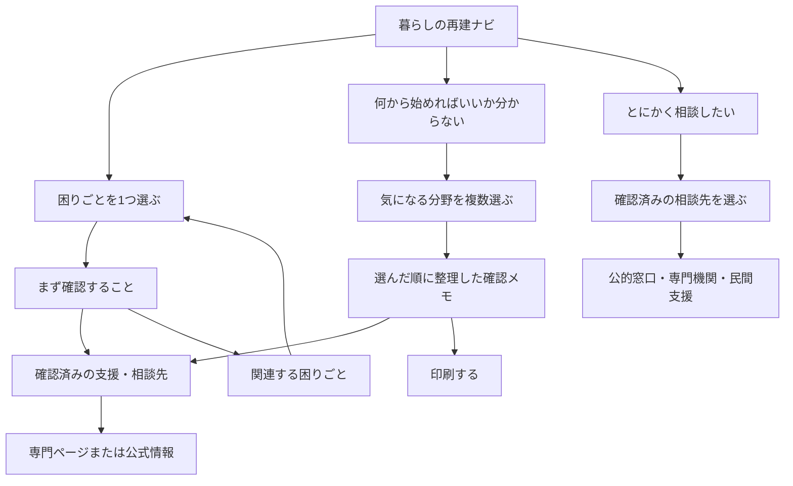

# 暮らしの再建・よろず相談ナビ 全体設計

- 対象サイト：一般社団法人よか隊ネット熊本 公式サイト
- 設計日：2026-08-10
- 状態：情報設計確定案（公開UI未実装）
- 提供主体：一般社団法人よか隊ネット熊本

## 1. 新しいページコンセプト

### 名称

**暮らしの再建ナビ**

### サブタイトル

**困りごとから、一緒に整理します。**

「よろず相談」はサービスの性格を示す補助表現として説明文やSEO文に使い、ページの主見出しには、短く理解しやすい「暮らしの再建ナビ」を使う。

### このページがすること

1. 制度名を知らなくても、今の困りごとを選べる。
2. 一つに見える困りごとの周囲に、別の生活課題がないか気づける。
3. 次に確認することを、最大3項目程度に整理する。
4. 確認済みの専門ページ、公的情報、相談先へつなぐ。
5. 本人だけでなく、家族や地域支援者が相談を受けながら使える。

### このページがしないこと

- 行政の認定、対象判定、申請受付、行政処分
- 医療・法律上の診断
- 個人情報や回答の保存
- AIによる相談、制度の自動判定
- 制度を大量に並べる検索ページ

ページ冒頭と相談先領域に「一般社団法人よか隊ネット熊本が提供する民間の情報整理・相談支援ページ」であることを明示する。

## 2. ファーストビュー案

> 暮らしの再建ナビ
>
> 困りごとから、一緒に整理します。
>
> 家のこと、お金のこと、仕事や家族のこと。何から相談すればよいか分からなくても大丈夫です。
>
> **今の困りごとを選ぶ**
>
> **何から始めればいいか分からない**
>
> **とにかく相談したい**

補足表示：

> このページは一般社団法人よか隊ネット熊本が提供する情報整理のためのナビです。行政による認定や申請受付を行うものではありません。選択内容や個人情報は保存しません。

最初の画面では説明を増やさず、3つの行動を大きなボタンで提示する。イラストは「人物・暮らし・相談」を表すものとし、文字を丸に入れただけの図解は使わない。

## 3. 困りごとカテゴリ

最初の入口は8カテゴリとする。制度名ではなく、市民が自分の言葉として選びやすい表現を使う。

| 表示名 | アイコンの意味 | 扱う範囲 | 主な接続先 |
|---|---|---|---|
| 家に住めない・家を直したい | 家 | 居住困難、修理、一時的な住まい | `uto-housing.html`、自治体別情報 |
| 生活費・支払いが心配 | 財布 | 生活費、税・保険料、ローン、借金 | 将来追加する確認済み制度・相談先 |
| 証明・申請が分からない | 書類 | 罹災証明、被害写真、各種手続き | `guide.html`、自治体別情報 |
| 健康・介護が心配 | ハート・人 | 健康、高齢者、介護、障がい、心のケア | 確認済みの公的・専門相談先 |
| 子ども・家族が心配 | 家族 | 学校、保育、学用品、子育て、家族生活 | 自治体・教育等の確認済み情報 |
| 仕事・事業を続けたい | 仕事かばん | 雇用と個人の仕事、事業者の再開 | カテゴリ内で「仕事」「事業」を分岐 |
| 農業・漁業を再開したい | 葉・魚 | 農林水産業、設備、生産、経営再開 | 専門窓口・一次産業向け支援 |
| 移動・日常生活で困っている | 車・水 | 車、交通、ごみ、ライフライン、日用品 | 自治体別情報、生活情報 |

カテゴリの下に、独立した大きな入口を2つ置く。

- **いろいろ重なって、何から始めればいいか分からない**
- **とにかく誰かに相談したい**

これらを「その他」の小さな選択肢にしない。

## 4. 「何から始めればいいか分からない」導線

### 画面

見出し：**今、気になっていることを選んでください**

補足：**いくつ選んでも大丈夫です。回答は保存されません。**

選択肢：

- 住まい
- お金・支払い
- 証明・手続き
- 健康・介護
- 子ども・家族
- 仕事・事業
- 農業・漁業
- 移動・日常生活
- まだ言葉にできない

チェックボックスはカード全体を押せるようにし、最低44×44px以上の操作領域を確保する。選択はJavaScriptのメモリ上だけに保持し、`localStorage`、Cookie、URLクエリ、サーバー送信は使わない。

### 結果

「あなたが選んだ困りごと」として選択内容を表示し、制度ではなく確認順を提示する。

例：

1. 住まいについて確認する
2. 生活費・支払いについて確認する
3. 健康・介護について確認する

この順は法的・医学的な優先順位ではなく、利用者が選んだ順を基本とする。確認済みの緊急性情報がある場合のみ、理由を示して先頭に注意表示する。

## 5. 基本画面構成

1ページ内の段階表示を基本とし、ページ遷移による迷子を防ぐ。

### A. 暮らしの再建トップ

- 短い説明
- 3つの主要行動
- 民間サービスであること、保存しないこと

### B. 困りごと選択

- 8カテゴリ
- 「何から始めればいいか分からない」
- 「とにかく相談したい」

### C. 困りごと詳細

全カテゴリで次の順序を統一する。

1. 今の困りごと
2. まず確認すること（最大3項目）
3. 次に確認できる支援（初期表示3件、最大5件）
4. 相談できるところ
5. 関連する困りごと
6. 詳しい専門ページ

### D. 複数困りごと整理結果

- 選んだ困りごと
- 確認する順番
- 各分野の「まず確認すること」
- 分野別の専門ページ・相談先
- 印刷ボタン

制度カードを全カテゴリ分混在させない。カテゴリ単位に折りたたみ、初期状態では確認順だけを見せる。

### E. 相談先案内

- 市町村・県・国などの公的窓口
- 社会福祉協議会・専門機関
- NPO・企業等の民間支援
- よか隊ネット熊本

出典で役割・対象地域・電話番号・受付時間を確認できた窓口だけを表示する。未確認の窓口は推測表示しない。

## 6. 画面遷移



戻る操作では、同じページ内の直前段階に戻る。ブラウザの戻る操作を妨げない。JavaScriptが無効でもカテゴリ一覧と専門ページへの基本リンクは読めるようにする。

## 7. 各カテゴリの役割

### 住まい

居住できるか、修理や一時的な住まいについて相談が必要かに気づく入口。制度説明は複製せず、宇土市の専門ページや自治体別情報へつなぐ。

### 生活費・支払い

収入減、住まい・仕事への影響、継続している支払いを整理する。具体的な給付・貸付・減免・ローン相談は、一次情報と相談先の確認後に追加する。

### 証明・申請

「罹災証明」という言葉を知らない人も入れる入口。被害記録、証明、申請先を分かりやすく分離する。

### 健康・介護

本人と家族の健康、高齢者、介護、障がい、心のケアへの気づきを支援する。症状の診断や緊急度判定は行わない。

### 子ども・家族

学校、保育、学用品、子育て、家族の生活変化を扱う。本人以外の困りごとにも気づける入口とする。

### 仕事・事業

入口は一つにし、詳細で「雇用・働き方」と「店舗・会社・事業再開」に分ける。個人向け制度と事業者向け制度を混在させない。

### 農業・漁業

地域的重要性と専門性が高いため独立入口を維持する。一般の事業支援に埋め込まない。

### 移動・日常生活

車、公共交通、ごみ、水道等のライフライン、日用品を扱う。時点で変化しやすい情報は自治体の一次情報へつなぐ。

## 8. 住まい専門ページとの役割分担

| 暮らしの再建ナビ | `uto-housing.html` |
|---|---|
| 住まいの困りごとに気づく | 宇土市の住まい支援を詳しく理解する |
| 暮らし全体との関連を整理する | 応急修理、賃貸型応急住宅等を説明する |
| 確認することを最大3項目で示す | 用語、対象となり得る修理、手続き等を説明する |
| 自治体を限定しない総合入口 | 宇土市専用の専門ページ |
| 専門ページへ送る | 一次情報と宇土市窓口へ送る |

ナビ側では、宇土市を選択済みまたは宇土市情報を見ている文脈でのみ「宇土市の住まいについて詳しく見る」と表示する。他自治体の利用者へ宇土市ページを一般案内として提示しない。

## 9. 関連する困りごとの見せ方

関連カテゴリは「条件確認」ではなく「見落とし防止」として表示する。

例：住まいを選んだ場合

- 修理費や毎月の支払いも心配ですか？ → 生活費・支払い
- 仕事や事業にも影響がありますか？ → 仕事・事業
- 高齢者や介護が必要な家族と暮らしていますか？ → 健康・介護
- 車や移動手段にも被害がありますか？ → 移動・日常生活

質問への回答で対象可否を示さない。「該当する場合はこちらも確認してください」とだけ案内する。

## 10. 支援制度の表示方法

制度は「利用できる可能性のある支援」として表示し、初期表示は3件、最大5件とする。

カードの必須項目：

- 何を助ける支援か
- 提供主体（国・県・市町村・民間）
- 今回の災害での確認状態
- 条件は窓口で確認が必要であること
- 確認済み相談先
- 公式情報へのリンク
- 情報確認日

状態ラベル：

- **今回の災害で確認済み**
- **公式発表を確認中**
- **一般制度の案内**
- **受付終了**

色だけで区別せず、必ず文字とアイコンを併用する。`draft`、`unverified`、`pending_review`のデータを公開カードへ出さない既存ルールを維持する。

## 11. 公的支援と民間支援

同じ一覧内で混ぜず、見出しとカード表示を分ける。

### 国・県・市町村などの公的支援

- 「公式情報」ラベル
- 発表主体
- 公式URL
- 行政による最終確認が必要との案内

### NPO・企業等による支援

- 「民間支援」ラベル
- **公的制度ではありません**という明示
- 提供団体、対象地域、実施期間、連絡先
- 一次情報または団体自身の発表

提供主体が不明、連絡先が未確認、終了日が古い情報は表示しない。

## 12. 相談導線

全カテゴリの末尾とページ下部に、同じ「分からなければ相談する」導線を置く。

相談先カードには次を表示する。

- 相談できる内容
- 公的窓口か民間窓口か
- 対象地域
- 電話・窓口・公式ページ
- 受付時間
- 情報確認日

よか隊ネット熊本への導線は`contact.html`へ接続し、「制度の認定・申請受付は行わない」「適切な情報・相談先を一緒に整理する」と説明する。個人情報入力フォームやケース記録機能は今回作らない。

## 13. 支援者向け利用

ページ内に折りたたみ式の「相談を受けている方へ」を置く。

内容：

1. 本人の言葉をもとに困りごとを複数選ぶ。
2. 一つの制度に当てはめず、関連する生活課題を確認する。
3. 表示結果は対象判定ではない。
4. 確認済みの公式情報・相談先へつなぐ。
5. 選択内容を本人の同意なく保存・共有しない。

支援者専用の判定表は作らない。

## 14. 印刷・相談メモ

最小UIの次段階で実装する。サーバーには保存しない。

印刷内容：

- 作成日時
- 選んだ困りごと
- 分野ごとの「まず確認すること」
- 確認済みの相談先
- 公式情報URL
- 手書き用の余白
- 「これは対象認定・申請書ではありません」という注意

印刷対象から、メニュー、装飾、選択ボタン、未選択カテゴリを除外する。氏名・住所・病歴等の入力欄は設けない。

## 15. アクセシビリティ要件

- 本文16px以上、主要説明18px以上を基準とする。
- 行間1.7以上、1行の長さは日本語40字程度を目安とする。
- タップ領域は最低44×44px、主要ボタンは高さ56px以上。
- 見出し階層とランドマークを正しく使う。
- カテゴリカードは実際のチェックボックスまたはボタンを使う。
- 選択状態を色だけで伝えず、チェックマークと「選択中」を表示する。
- アイコンには補助的意味だけを持たせ、可視ラベルを省略しない。
- 動的結果は`aria-live="polite"`で通知する。
- キーボードだけで選択、戻る、印刷ができる。
- フォーカスを明瞭に表示する。
- `prefers-reduced-motion`時はアニメーションを停止する。
- JavaScript無効時もカテゴリと基本リンクを表示する。
- 320px幅で横スクロール、重なり、不自然な単文字改行を発生させない。

## 16. 既存サイトとの統合

| 既存ページ | 役割 | 新ナビとの関係 |
|---|---|---|
| `index.html` | 団体と現在活動の入口 | 新ナビへの目立つ入口を1つ置く |
| `disaster.html` | 令和8年熊本地震情報ポータル | 被災者向けの主要入口として接続 |
| `affected.html` | 困りごと別の情報入口 | 「暮らし全体を整理したい」人を新ナビへ送る |
| `supporters.html` | 支援者向け情報 | 「相談を受けながら使う」導線を置く |
| `municipalities.html` | 自治体別情報 | 地域選択後の公式情報確認先 |
| `guide.html` | 制度・生活支援ガイド | 証明・申請カテゴリの専門情報先 |
| `uto-housing.html` | 宇土市の住まい専門ページ | 宇土市の住まいカテゴリから接続 |
| `contact.html` | よか隊ネット熊本への連絡 | 「相談先が分からない」場合の民間相談導線 |

新ページ公開時の候補URLは`livelihood.html`とする。削除済みの`reconstruction.html`を再利用せず、旧設計と新設計をURL上でも区別する。公開前に名称・URLを最終承認する。

## 17. 既存データ基盤との接続

`data/reconstruction/`は維持する。既存の検証・公開フィルターを通過した情報だけをUIへ渡す。

### 既存データの利用

- `programs.json`：制度の基本情報
- `applications.json`：今回災害・対象地域との関係
- `municipality-application-statuses.json`：自治体ごとの状態
- `contacts.json`：確認済み相談先
- `next-actions.json`：安全に提示できる次の行動
- `consultation-items.json`：支援者と本人が確認する項目
- `source-links.json`、`sources.json`：根拠と公式URL
- `verification-events.json`：確認・承認履歴

### 次段階で追加する薄いナビ定義

制度データを作り直さず、表示用の対応表を別ファイルで持つ。

候補：`data/reconstruction/navigation-topics.json`

```json
[
  {
    "id": "topic_housing",
    "label": "家に住めない・家を直したい",
    "icon": "house",
    "checkPrompts": [],
    "relatedTopicIds": ["topic_money", "topic_work", "topic_health"],
    "programIds": [],
    "contactIds": [],
    "specialistLinks": []
  }
]
```

この定義に対象可否の判定式を置かない。`programIds`等は公開可能状態のデータとの接続にだけ使う。ラベル・確認文・関連カテゴリは人手レビュー対象とする。

### 公開条件

1. 制度・相談先が`published`相当である。
2. 根拠sourceLinkが存在する。
3. 高リスク値が人手確認済みである。
4. freshnessが期限内である。
5. 自治体別情報は自治体IDが一致する。
6. 民間支援は公的支援と明確に区別されている。

条件を満たさない場合は制度名や窓口を推測表示せず、「公式情報を確認中」とするかカード自体を出さない。

## 18. 今回実装したUI

今回、公開UIは実装しない。

理由：

- `reconstruction.html`は見直しのため削除した直後であり、旧UIの置換を急がない。
- 今回の指示は全体情報設計・役割分担・データ接続方針の決定が中心である。
- 全カテゴリ詳細、制度、相談先を未確認のまま見せることを避ける。
- ページ名称と候補URLの最終承認後に、最小UIを独立して検証できる。

## 19. 次の開発ステップ

### STEP 11：最小UI仕様・確認

1. ページ名称「暮らしの再建ナビ」とURL`livelihood.html`を承認する。
2. 8カテゴリの文言とアイコンを市民・支援者で確認する。
3. 各カテゴリの「まず確認すること」を最大3項目で作成し、安全性レビューを行う。
4. `navigation-topics.json`のSchemaとfixtureを作る。

### STEP 12：最小UI試作

1. ファーストビュー
2. 8カテゴリ入口
3. 「何から始めればいいか分からない」複数選択
4. 「とにかく相談したい」導線
5. 住まいから`uto-housing.html`への接続
6. 保存しないことの自動テスト
7. キーボード、スクリーンリーダー、320px表示、印刷の検査

### STEP 13：確認済み情報の段階的接続

1. Reviewer、Secondary Reviewer、Approverが完了した制度・窓口だけを接続する。
2. 公的支援と民間支援を分ける。
3. 自治体IDによる地域別表示を検証する。
4. 古い情報を自動で公開停止できるfreshness検査を追加する。

## 20. 完了判定

次を満たした時点で最小UIを公開候補とする。

- 5秒以内に「困りごとを整理するページ」と理解できる。
- 制度名を知らなくても入口を選べる。
- 「何から始めればいいか分からない」が独立した主要入口になっている。
- 選択内容や個人情報を保存しない。
- 住まい専門ページと重複しない。
- 対象判定・認定・医療診断をしない。
- 未確認の制度・相談先を表示しない。
- 本人と支援者の両方が利用できる。
- 320px幅、キーボード、読み上げ、印刷で利用できる。
