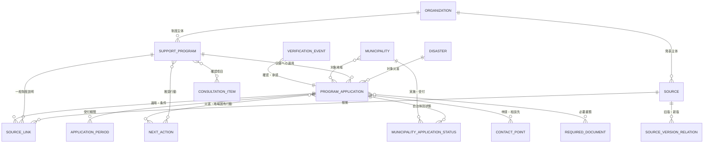
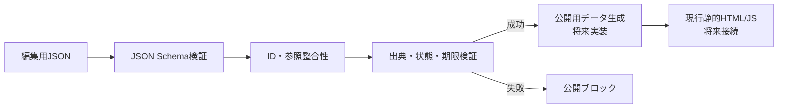

# 生活再建支援データ基盤 開発者向け設計

## 目的

この基盤は、生活再建制度を表示するUIではなく、間違った制度情報を利用者向け画面へ公開しにくくするための編集・検証層である。

現行のHTML/CSS/Vanilla JavaScriptとVercel静的配信を維持し、当面はJSONを正本とする。将来DBへ移行してもIDと関係を維持できる正規化構造を採用する。

## エンティティ関係

## 責務分離

### supportProgram

制度そのものの一般定義を持つ。正式名称、一般向け名称、困りごとカテゴリ、提供主体、一般説明を管理する。金額、対象自治体、今回の期限を固定しない。

### programApplication

制度が特定災害・地域へ適用される事実を持つ。`supportProgram` が存在しても、確認済みの `programApplication` がなければ今回利用できる制度として扱わない。

同じ `programApplication` の中でも「県が制度対象地域として公表したこと」と「各自治体の受付詳細が確認できたこと」は別の事実である。対象地域に含まれていても、自治体固有の開始日・期限・窓口が未確認なら、自治体の `applicationPeriod` や `contactPoint` を推測作成しない。

### municipalityApplicationStatus

`programApplication` と自治体の中間エンティティである。制度の災害適用、対象地域、自治体受付、受付方法、申請窓口、自治体独自案内を別々に保持する。

`implementationStatus` は対象地域としての実施状況、`receptionStatus` は受付の運用状態であり、`verificationStatus` は根拠と人の確認度である。これらを相互に読み替えない。

### source / sourceLink

`source` は原資料、`sourceLink` は原資料がどの事実を裏付けるかを表す。URLだけでなく、PDFページ、Web見出し、表番号、必要最小限の抜粋を指定できる。

### sourceVersionRelation

原資料の`revision`、`replacement`、`withdrawal`だけを管理する。双方向の複数属性をsource本体へ埋め込まず、旧版と新版を1本の関係として記録する。同じURLでハッシュが変わった場合も別sourceを作る。

### verificationEvent

確認・承認を追記型履歴として記録する。`reviewed`または`reverified`が一次情報確認、`approved`が公開可能性の承認である。自動照合の担当名を記録することはできるが、`system_`の確認者は人によるレビューとして数えない。

### contactPoint

申請先・相談先を制度から分離する。電話番号や受付時間の変更時に、制度マスタを複製しない。

`contactRole` で申請窓口と一般問い合わせ先を分ける。公式資料に問い合わせ先として載っている県窓口を、自治体の申請窓口へ読み替えない。

### applicationPeriod

`periodPurpose` で期限の意味を明示する。

- `application_window`: 申込受付期間
- `repair_completion`: 工事完了期限
- `program_effective_period`: 制度適用期間
- `temporary_housing_use`: 応急修理期間中の応急仮設住宅利用期間

異なる期限を1レコードへまとめない。正式発表待ちは `deadlineAt: null`、`deadlineType: pending`、`status: pending_announcement` とする。自治体固有の受付を `open` にする場合は、自治体IDと根拠のある開始日を必須とする。

### requiredDocument

`scopeLevel`は資料の発表・案内レベル、`documentContext`は一般制度か今回災害か自治体固有かを表す。県資料で確認した書類を自治体独自書類として登録しない。`programIds`、`applicationIds`、`scopeMunicipalityIds`、`sourceLinkIds`から由来を追跡する。

### nextAction

「次にすること」「まだしないこと」を制度説明から分離する。特に `doNotDoYet` は出典を必要とする重要情報として扱う。

### consultationItem

相談時に何を確認するかを定義する。回答保存用モデルではない。初期質問は原則3件程度とし、`allowUnknown` と `allowDecline` を必須とする。

## 状態軸

状態は混在させず、次を別々に管理する。

- `publicationStatus`: 編集・公開・撤回・保存
- `verificationStatus`: 情報の確認度
- `freshnessStatus`: 最終確認から見た鮮度
- `applicationStatus`: 災害適用の受付・運用状態
- 自治体別status: 対象地域・受付・方法・窓口・独自案内の確認状態

たとえば「制度は存在するが今回の適用は発表待ち」は、制度マスタを `draft/pending`、適用を `draft/pending` とする。制度の存在から災害適用を推論しない。

## 公開境界

現段階ではE以降を実装しない。検証スクリプトは既存の3時間更新Workflowにもまだ組み込まない。

## verified昇格と二重確認

`verified`は次をすべて満たす場合だけ許可する。

1. Schemaと参照整合性が正常
2. 正式な一次情報とclaim単位のsourceLinkがある
3. 人による`reviewed`または`reverified`イベントがある
4. 承認者を持つ`approved`かつ`confirmed`イベントがある
5. 根拠sourceが撤回・旧版ではない
6. 承認後にsource更新が検知されていない
7. `freshnessStatus`が`fresh`

確認者と承認者は別人物を推奨する。金額、期限、対象地域、電話番号、必要書類、受付状態は二重確認対象とする。一人運用では同一人物を許容するが警告し、承認履歴そのものは省略できない。

## 将来の公開変換ルール

| 内部状態 | 利用者向け表現 |
|---|---|
| 災害適用`verified`、自治体実施`confirmed`、受付`confirmed`、自治体状態`verified` | 「この自治体で受付を確認済みです」 |
| 災害適用が確認済み、自治体実施`confirmed`、受付`pending` | 「制度の対象地域ですが、受付方法は現在確認中です」 |
| 自治体実施`confirmed`、連絡先`pending` | 「対象地域です。自治体の申請窓口は現在確認中です」 |
| 県の一般問い合わせ先のみ確認済み | 「熊本県の相談先は確認済みです。自治体の申請窓口ではありません」 |
| `needs_review`または根拠source変更 | 「公式情報を再確認しています」 |

内部status名は画面へ直接表示しない。対象可否を断定する文章は、自治体別受付の確認と承認が揃った場合だけ生成する。

## 鮮度と変更検知

データには`freshnessStatus`と`lastCheckedAt`を保持し、運用では再確認間隔を設定する。sourceの同一URL・異なるハッシュ、公式更新日時変更、期限接近・超過、窓口・電話番号変更、受付開始前・停止・終了を検知した場合、関連エンティティを`needs_review`へ戻す。期限超過だけで`closed`へ自動変更せず、公式発表を確認する。

再確認目安は、自治体受付・窓口・電話番号は毎日、30日以内の期限は毎日、その他の条件・書類は週1回、一般制度は月1回とする。

## PDFアーカイブ規約

- source IDは資料の版ごとに発行する。
- 原URL、取得日時、発表主体、発表日、改訂日、SHA-256、保存先を記録する。
- 同一URLでSHA-256が変われば差替えとみなし、旧sourceを上書きしない。
- 新旧sourceを`source-version-relations.json`で結ぶ。
- 改訂・差替えの旧版は`superseded`、撤回対象は`withdrawn`とする。
- 旧版・撤回版を`verified`の現行根拠に使用しない。
- 保存できない場合もURL、取得日時、ハッシュを必須とし、理由をnotesへ残す。

## 検証方針

`scripts/validate-reconstruction-data.js` はNode.js標準機能だけで次を確認する。

- JSON構文
- Draft 2020-12 Schemaの使用と定義内容
- 型、必須項目、追加項目、列挙値、ID形式、日付形式、URL
- 全コレクションを通したID重複
- 制度、災害、自治体、組織、出典、窓口、期間、書類、行動の参照先
- `verified` の重要項目と出典
- 公的制度の正式な一次情報
- 未確認適用の `active` / `published` 化
- 終了・撤回情報と公開状態の矛盾
- 過去期限と受付状態の矛盾
- 期限の意味、正式発表待ちと日付値の矛盾
- 自治体受付をopenとする場合の自治体ID・開始日の根拠
- 自治体別実施・受付・方法・窓口状態の矛盾
- 必要書類のscope、制度、災害適用、自治体、出典の追跡
- verifiedに必要な人のレビューと承認履歴
- 撤回・旧版sourceをverifiedの根拠にしていないこと
- source改訂関係と同一URLのハッシュ変更
- 重要な「まだしないこと」の出典
- 現行自治体データとの名称・公式URL同期

この実装は外部JSON Schemaライブラリを追加せず、使用中のSchemaキーワードを検査する最小バリデータを内包する。将来Schemaが複雑化し、`if/then/else`、`unevaluatedProperties`、高度なformat等が必要になった場合は、Ajv等の標準的なDraft 2020-12実装への置換を検討する。

## 将来DBへの対応

各JSONファイルは将来のテーブル境界を意識している。配列indexではなく永続IDを使い、多対多関係はID配列または将来の関連テーブルへ移行できる形とする。

DB化時も、公開制度情報と個人の相談・ケース情報は別の権限領域にする。現在のデータには個人回答を保存しない。

## 実在制度パイロットでの確認事項

「災害救助法に基づく被災住宅の応急修理」は、次の3層を分離して登録する。

1. 一般制度: `program_emergency_housing_repair`
2. 令和8年熊本地震における熊本県実施: `application_r8_kumamoto_emergency_repair`
3. 宇土市固有の受付: 公式確認できた `contactPoint` と `applicationPeriod` のみ

2026年8月9日の確認時点では、熊本県は宇土市を対象地域に含めている一方、県の窓口一覧で宇土市の担当部署、受付開始日、連絡先、自治体案内URLを「確認中」としている。このため宇土市固有の受付窓口は登録せず、受付期間は正式発表待ちのレコードとして保持する。

PDF原本は公式URLとSHA-256を記録した。既存リポジトリには火の国会議資料向けの保存構成はあるが、生活再建制度資料の重複保存・更新ルールが未定義のため、このパイロットではバイナリを追加していない。将来は取得日、原URL、ハッシュ、更新関係を含む共通アーカイブ規約を定める。
